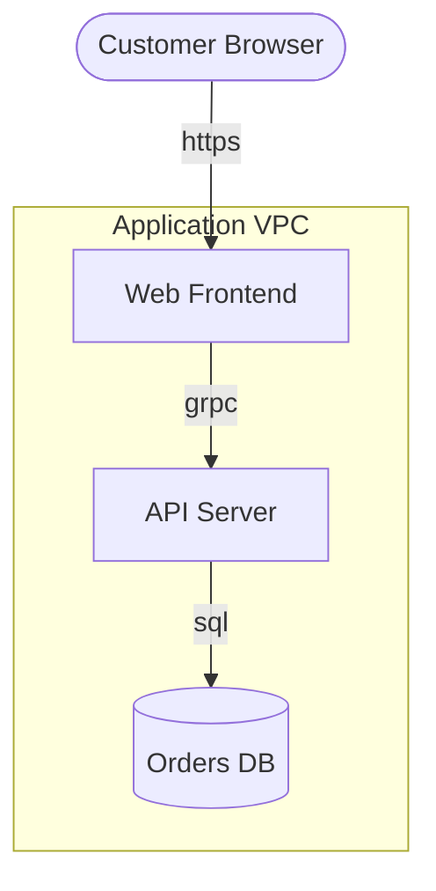

# Cookbook: diagram → trusted model in 10 minutes

The full loop from an architecture diagram nobody threat-models to a
reviewed, CI-gated Threagile model — deterministic, no AI. This walkthrough
uses a Mermaid flowchart because it lives in the repo next to the code, but
every step works identically with `import drawio`, `import otm`, or
`import threat-dragon`.

## 1. Start with the diagram you already have

`architecture.mmd`:



## 2. Import it as an editable scaffold

```sh
threagile import mermaid --diagram architecture.mmd --output model.yaml
```

Defaults do the heavy lifting:

- **`--scaffold`** (on): every guessed field gets a `# TODO(review): …`
  comment, and every generated element is tagged `review-mermaid` — see
  [import-scaffold.md](./import-scaffold.md).
- **`--stub-data-assets`** (on): the datastore and the internet-inbound link
  get stub data assets (tagged `stub-data-asset`), because a model without
  data assets analyzes to near-zero risk — replace them with the real data.
- **`--mapping your-rules.yaml`** (optional): teach the importer your team's
  box-label nomenclature and diagram color conventions instead of relying on
  the built-in keyword heuristics — see [import-mapping.md](./import-mapping.md).
- **`--boundary "Application VPC"`** (optional): on a big enterprise diagram,
  import one subsystem at a time instead of one unreviewable mega-fragment.

## 3. Review: work the checklist, release each element

```sh
threagile review --model model.yaml --format markdown
```

lists every element still carrying a `review-mermaid`/`stub-data-asset` tag.
For each one: fix the guessed fields (`type`, `technology`, `encryption`,
CIA ratings — the `TODO(review)` comments point at exactly these), then
**remove the `review-mermaid` tag as the last step**. That tag removal is the
"a human confirmed this" signal — `--merge` (step 6) relies on it.

Formatting mid-review is safe: `threagile fmt` preserves the scaffold
comments.

## 4. Validate and analyze

```sh
threagile validate --model model.yaml
threagile analyze-model --model model.yaml --output out
```

## 5. Gate it in CI

```yaml
# policy.yaml
fail_on_unreviewed: true
max_high_risks: 0
```

```sh
threagile review --model model.yaml --fail-on-unreviewed   # exit 3 while tags remain
threagile gate --model model.yaml --policy policy.yaml     # same signal, plus risk rules
```

`fail_on_unreviewed: true` blocks merging until every imported guess has been
confirmed — see [review.md](./review.md) and [gate.md](./gate.md).

## 6. The diagram changed? Merge, don't re-import

When the architecture diagram is redrawn, don't overwrite your reviewed
model — reconcile:

```sh
threagile import mermaid --diagram architecture.mmd --merge model.yaml
```

New elements are appended (tagged for review like any fresh import),
still-importer-owned elements refresh from the diagram, and everything you
confirmed in step 3 is left untouched — if the diagram now disagrees with a
confirmed field, the element gains a `merge-conflict:<field>` tag instead of
being overwritten. See [import-merge.md](./import-merge.md).

## The whole loop

```sh
threagile import mermaid --diagram architecture.mmd --output model.yaml
$EDITOR model.yaml                       # fix guesses, remove review tags
threagile review --model model.yaml --fail-on-unreviewed
threagile validate --model model.yaml
threagile analyze-model --model model.yaml --output out
threagile gate --model model.yaml --policy policy.yaml
# ...architecture evolves...
threagile import mermaid --diagram architecture.mmd --merge model.yaml
```
