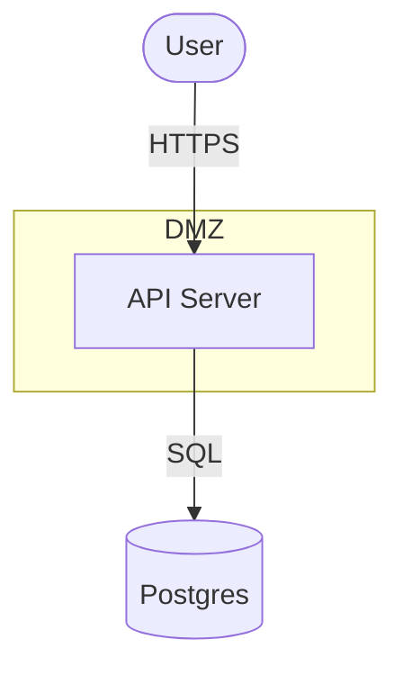

# `threagile import mermaid` — diagram → model (best-effort, no AI)

Converts a [Mermaid](https://mermaid.js.org/) `flowchart`/`graph` diagram — the
text diagram format most often embedded directly in READMEs — into a
Threagile model fragment. The conversion is **deterministic** (no AI), but
because Mermaid flowcharts are a *generic* diagram format with no built-in
threat-model semantics, it is necessarily **lossy** — nodes are classified by
their bracket syntax and label. Every generated asset is tagged
**`review-mermaid`** so you remember to verify and refine the fragment.

> This is the reverse direction of the existing `threagile mermaid` command
> (which renders a Threagile model *as* a Mermaid diagram). The two are
> unrelated packages internally; round-tripping through both is not
> guaranteed to be lossless.

```sh
threagile import mermaid --diagram architecture.mmd --output model-fragment.yaml
threagile analyze-model --model model-fragment.yaml --output out
```

## Supported grammar



- `flowchart` and the legacy `graph` keyword are both accepted, in any
  direction (`TD`/`TB`/`LR`/`RL`/`BT` — direction is parsed but has no effect
  on the model).
- `%% ...` line comments are stripped.
- Node declarations may appear on their own line or inline on an edge line;
  once a node is declared its shape/label is fixed — later bare references
  (e.g. a plain node id repeated inside a `subgraph`) only affect boundary
  membership.
- Edges: `A --> B`, `A -->|label| B`, `A --- B` (no arrowhead), `A -.->|label| B`
  (dotted — tagged `mermaid-dotted-edge`), `A ==>|label| B` (thick). The edge
  label becomes the link title and is used to guess the protocol.
- `subgraph "Name" ... end` or `subgraph id["Name"] ... end` (quotes optional)
  becomes a trust boundary; nesting one `subgraph` inside another produces
  nested trust boundaries (`trust_boundaries_nested`).
- Malformed/garbage input never panics: unparseable lines are skipped for a
  best-effort partial parse, and a document with no recognisable nodes
  returns a clear error.

## Mapping (heuristic)

| Mermaid syntax | Threagile |
|-----------------|-----------|
| `id([Label])` (stadium) | External-entity (internet-facing), technology `client-system` |
| `id[(Label)]` (cylinder) | Datastore, technology classified from the label (postgres/mysql/mongo/redis/… → database, s3/bucket/minio → file-server, vault → vault, kafka/queue → message-queue, …) |
| `id{Label}` (rhombus/decision) | Process, technology `web-server` |
| `id[Label]` (rectangle) or a bare `id` | Process by default, unless the label matches a datastore/external-entity keyword (same heuristic as `threagile import drawio`) |
| Edge (`-->`, `---`, `-.->`, `==>`) | Communication link; edge label → protocol guess (`https`/`tls`/`grpc` → HTTPS, `sql`/`postgres`/`mysql`/`jdbc`/`odbc` → SQL access (encrypted), `ssh`, `ftp`/`sftp`/`ftps`, `ldap`/`ldaps`, `smtp`, `mqtt`, `kafka`/`amqp`/`queue`/`jms`, `nfs`, `smb`; unmatched labels default to HTTPS) |
| `subgraph "Name"` / `subgraph id["Name"]` | Trust boundary — direct members are the nodes declared/referenced directly inside it; nested `subgraph`s become nested trust boundaries. Names containing internet/untrusted/public/dmz become on-prem (untrusted) boundaries, matching `threagile import drawio`'s classification |

A technical asset that is the direct target of an edge from an external
entity is marked internet-facing.

## Flags

| Flag | Default | Meaning |
|------|---------|---------|
| `--diagram` | stdin | Path to the `.mmd` (or any text) file containing the Mermaid flowchart |
| `--output` | stdout | Write the fragment to a file |
| `--label` | `mermaid` | Short label appended to generated asset IDs |
| `--diff` | false | Print a summary without writing |
| `--scaffold` | true | Annotate inferred fields with `# TODO(review): …` comments — see [docs/import-scaffold.md](./import-scaffold.md) |
| `--mapping` | — | Team nomenclature rules — see [docs/import-mapping.md](./import-mapping.md) |
| `--stub-data-assets` | true | Generate stub data assets for datastores/internet-inbound links that have none — diagrams rarely draw data assets, and without them the model analyzes to near-zero risk |

After importing, run [`threagile review`](./review.md) to list every element
still carrying a `review-mermaid` (or `stub-data-asset`) tag before trusting
the model for analysis.
