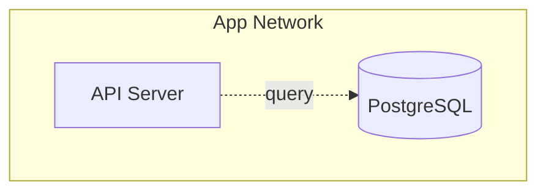

# `threagile mermaid` — Mermaid data-flow diagram

Renders the model as a [Mermaid](https://mermaid.js.org/) flowchart — plain text
that **GitHub, GitLab and most Markdown renderers display natively**. Unlike the
built-in Graphviz data-flow diagram (which shells out to the `dot` binary and
produces a PNG), this needs no image toolchain, so you can drop an
architecture / data-flow picture straight into a pull-request comment, README or
CI job summary. The conversion is fully deterministic and uses **no AI**.

```sh
threagile mermaid --model threagile.yaml
threagile mermaid --model threagile.yaml --format markdown --output diagram.md
threagile mermaid --model threagile.yaml --direction LR --with-risks=false
```

## How the model maps to the diagram

| Model element | Mermaid rendering |
|---|---|
| Trust boundary | `subgraph` (nested boundaries render inside their parent) |
| Technical asset — datastore | cylinder node `[( … )]` |
| Technical asset — external entity | stadium node `([ … ])` |
| Technical asset — process | box node `[ … ]` |
| Communication link (encrypted / VPN) | solid edge `-->` labelled with the link title |
| Communication link (cleartext) | dashed edge `-.->` |
| Internet-facing asset | `internet` class (blue border) |
| Out-of-scope asset | `outofscope` class (grey, dashed) |
| Highest still-at-risk severity (with `--with-risks`) | node fill colour: Critical → Low |

Assets that belong to no trust boundary are rendered at the top level under an
`%% assets outside any trust boundary` comment.

## Flags

| Flag | Default | Description |
|---|---|---|
| `--format` | `flowchart` | `flowchart` (raw Mermaid) or `markdown` (wrapped in a ```` ```mermaid ```` fenced block) |
| `--direction` | `TB` | Flow direction: `TB` (top-bottom) or `LR` (left-right) |
| `--with-risks` | `true` | Colour each asset by the highest severity of its still-at-risk findings |
| `--output` | — | Also write the rendered diagram to this file |

## Embedding in Markdown

With `--format markdown` the output is a fenced block that renders inline on
GitHub/GitLab:

````markdown

````

Because the output is deterministic, you can commit it and diff it in CI to catch
unintended architecture changes.
